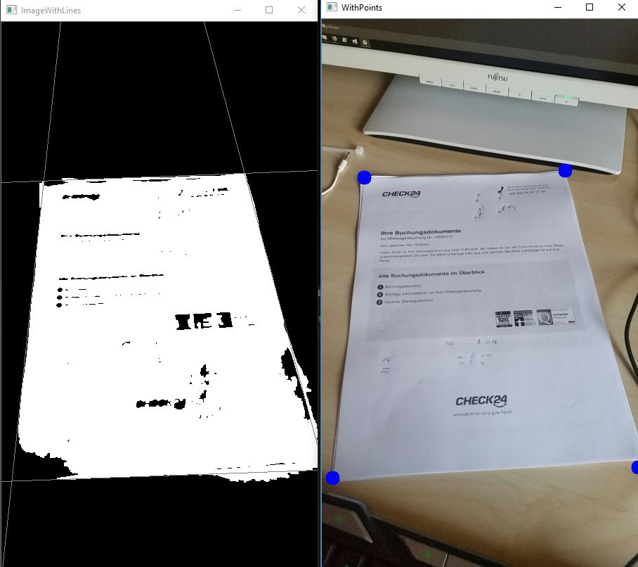

# opencv-document-scanner

## Screenshot:

This is the document scanner code used in this app:

[https://play.google.com/store/apps/details?id=schaefferdstudio.boardredoc](https://play.google.com/store/apps/details?id=schaefferdstudio.boardredoc)

# Changes:
This work with opencv
So a opencvversion must be include as include and librarys